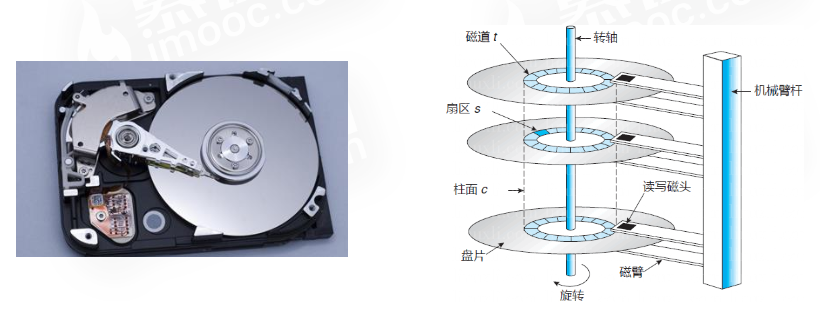
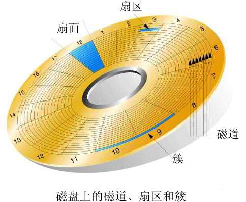

# 计算机硬盘的结构和工作原理

学习操作系统的文件系统必须要了解一下计算机的硬盘的结构和工作方式，否则，对存取效率等问题不能很好的理解，今天学习了一下机械硬盘的结构和原理，在这里和大家分享一下。

    由上图所示，机械硬盘主要由以下几部分组成：机械手臂（Boom）,磁头（Head）,转轴（Spindle），盘片（Platter）组成，在实际应用中又将盘片分成了磁道（Track），扇区（Sector）和柱面（Cylinder），下面就分别介绍一下这些组成部分。

### 机械手臂

    机械手臂由控制电路控制，可以前后移动，在机械手臂的前端有磁头，机械手臂的作用就是，移动磁头，使磁头位于正确的位置上。

### 磁头

     磁头由机械手臂控制在盘片上移动。读写硬盘时，磁头依靠磁盘的高速旋转引起的空气动力效应悬浮在盘面上，与盘面的距离不到1微米(约为头发直径的百分之一)，可以在极短的时间内精确定位到计算机指令指定的磁道上。磁头的数量与盘片数量有关。一张单面的磁盘需要一个磁头，如果是双面的磁盘，则需要两个磁头，整个硬盘的磁头的数量就是各个盘片所需要的磁头的数量的总和。

### 盘片

    硬盘的存储介质，所有的信息都存储在这里，盘片分为单面盘片和双面盘片，单面盘片只能在一面进行存储，双面盘片能在两面进行存储。硬盘的盘片一般采用合金材料，多数为铝合金(IBM曾经开发过玻璃材质的盘片，好像现在有些厂家也生产玻璃材质的盘片，但不多见)，盘面上涂着磁性材料，厚度一般在0.5mm左右。有些硬盘只装一张盘片，有些则有多张。硬盘盘片安装在主轴电机的转轴上，在主轴电机的带动下作高速旋转。每张盘片的容量称为单碟容量，而一块硬盘的总容量就是所有盘片容量的总和。早期硬盘由于单碟容量低，所以盘片较多。现代的硬盘盘片一般只有少数几片。 盘片上的记录密度很大，而且盘片工作时会高速旋转，为保证其工作的稳定，数据保存的长久，所以硬片都是密封在硬盘内部。不可自行拆卸硬盘，在普通环境下空气中的灰尘、指纹、头发丝等细小杂质都会对硬盘造成永久损害。 硬盘一般会有一个或多个盘片，每个盘片可以有两个面(Side)，即第1个盘片的正面称为0面，反面称为1面；第2个盘片的正面称为2面，反面称为3面…依次类推。每个盘面对应一个磁头(head)用于读写数据。第一个盘面的正面的磁头称为0磁头，背面称为1磁头；第二个盘片正面的磁头称为2磁头，背面称为3磁头，以此类推。盘面数和磁头数是相等的。

### 磁道

     每个盘片的每个盘面被划分成多个狭窄的同心圆环，数据就是存储在这样的同心圆环上，我们将这样的圆环称为磁道(Track)，每个盘面可以划分多个磁道。在每个盘面的最外圈，离盘心最远的地方是“0”磁道，向盘心方向依次增长为1磁道，2磁道，等等。硬盘数据的存放就是从最外圈开始。

扇区

     根据硬盘规格的不同，磁道数可以从几百到成千上万不等。每个磁道上可以存储数KB的数据，但计算机并不需要一次读写这么多数据。在这一这基础上，又把每个磁道划分成若干弧段，每段称为一个扇区(Sector)。扇区是硬盘上存储的物理单位，每个扇区可存储128×2N次方（N＝0,1,2,3）字节的数据。从DOS时代起，每扇区是128×22＝512字节，现在已经成了业界不成文的规定，也没有哪个硬盘厂商试图去改变这种约定。也就是说即使计算机只需要硬盘上存储的某个字节，也须一次把这个字节所在的扇区中的全部512字节读入内存，再选择所需的那个字节。扇区的编号是从1开始，而不是0，这一点需要注意。另外，硬盘在划分扇区时，和软盘是有一定区别的。软盘的一个磁道中，扇区号一般依次编排，如1号，2号，3号…以此类推。但在硬盘磁道中，扇区号是按照某个间隔跳跃着编排。比如，2号扇区并不是1号扇区后的按顺序的第一个而是第八个，3号扇区又是2号扇区后的按顺序的第八个，依此类推，这个“八”称为交叉因子。

     这个交叉因子的来历有必要详述一下，我们知道，数据读取经常需要按顺序读取一系列相邻的扇区(逻辑数据相邻)。如对磁道扇区按物理顺序进行编号，很有可能出现当磁头读取完第一个扇区后，由于盘片转速过快来不及读取下一个扇区，(要知道物理相邻扇区位置距离是极小的)，必须等待转完一圈，这极大浪费了时间。所以就用交叉来解决这个问题。

### 柱面

     柱面其实是我们抽象出来的一个逻辑概念，前面说过，离盘心最远的磁道为0磁道，依此往里为1磁道，2磁道，3磁道….，不同面上相同磁道编号则组成了一个圆柱面，即所称的柱面(Cylinder)。这里要注意，硬盘数据的读写是按柱面进行，即磁头读写数据时首先在同一柱面内从0磁头开始进行操作，依次向下在同一柱面的不同盘面(即磁头上)进行操作，只有在同一柱面所有的磁头全部读写完毕后磁头才转移到下一柱面，因为选取磁头只需通过电子切换即可，而选取柱面则必须通过机械切换。电子切换比从在机械上磁头向邻近磁道移动快得多。因此，数据的读写按柱面进行，而不按盘面进行。 读写数据都是按照这种方式进行，尽可能提高了硬盘读写效率。

### 簇

     将物理相邻的若干个扇区称为了一个簇。操作系统读写磁盘的基本单位是扇区，而文件系统的基本单位是簇(Cluster)。在Windows下，随便找个几字节的文件，在其上面点击鼠标右键选择属性，看看实际大小与占用空间两项内容，如大小：15 字节 (15 字节)， 占用空间：4.00 KB (4，096 字节)。这里的占用空间就是你机器分区的簇大小，因为再小的文件都会占用空间，逻辑基本单位是4K，所以都会占用4K。 簇一般有这几类大小 4K，8K，16K，32K，64K等。簇越大存储性能越好，但空间浪费严重。簇越小性能相对越低，但空间利用率高。NTFS格式的文件系统簇的大小为4K。

### 硬盘的工作原理

     现代硬盘寻道都是采用CHS(Cylinder Head Sector)的方式，硬盘读取数据时，读写磁头沿径向移动，移到要读取的扇区所在磁道的上方，这段时间称为寻道时间(seek time)。因读写磁头的起始位置与目标位置之间的距离不同，寻道时间也不同。目前硬盘一般为2到30毫秒，平均约为9毫秒。磁头到达指定磁道后，然后通过盘片的旋转，使得要读取的扇区转到读写磁头的下方，这段时间称为旋转延迟时间(rotational latencytime)。
————————————————
版权声明：本文为CSDN博主「xingjiarong」的原创文章，遵循 CC 4.0 BY-SA 版权协议，转载请附上原文出处链接及本声明。
原文链接：https://blog.csdn.net/xingjiarong/article/details/46312571